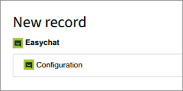
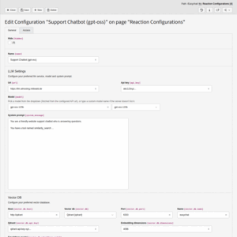
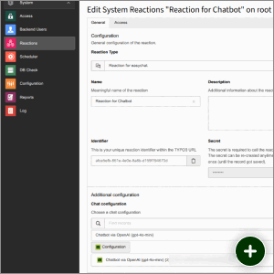
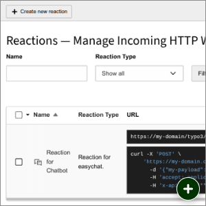
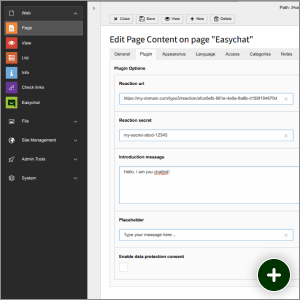
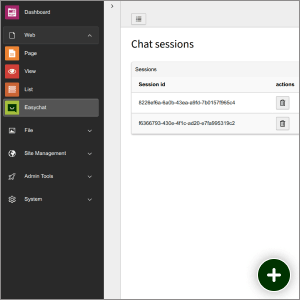
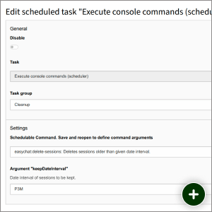
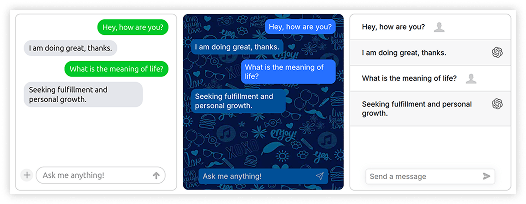
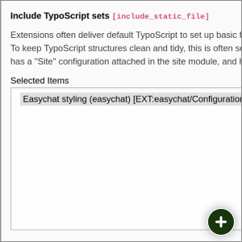

# EasyChat Chatbot (TYPO3 Extension)

----

 

----


----


**EasyChat** is a lightweight open source chatbot for [TYPO3](https://typo3.org) websites without third party chat tools.

All you need is TYPO3 and an LLM endpoint.

EasyChat is **focused on privacy** and data protection, since all chat conversions are only stored in your TYPO3 database.

----

## 🚀 Features

* 🗨 **Chatbot frontend**
  * based on the open source chat framework [Deep Chat](https://deepchat.dev) (Supports: Vanilla JS, Vue, React, Angular etc.)


* 🤖 **LLM Endpoints** for
  * (self hosted) open source LLM's (e.g. gpt‑oss) and
  * standard LLMs (ChatGPT, Cloude Opus, Mistral etc.)
  * Chat memory (Chatbot can remember old questions)


* 🔒 **Data protection**:
  * Chat session **data is saved only within TYPO3** (on your own server)
  * Optional **privacy consent** before the chat starts
  * Automated **cleaning of user data** (scheduler task)

* ⛁ **Knoledge base** connector (to vector database)

---

## 🛠️ Setup guide (5 Steps)

### 1. Install the TYPO3 Extension

Install the **TYPO3 ChatBot Extension _EasyChat_** via [composer](https://getcomposer.org/doc/):

```console
composer require undkonsorten/easychat
```

After installation a **database compare** is necessary (via [Install Tool](https://docs.typo3.org/m/typo3/reference-coreapi/main/en-us/ApiOverview/Database/DatabaseUpgrade/Index.html#database-upgrade) or [TYPO3 Console](https://docs.typo3.org/m/typo3/reference-coreapi/main/en-us/ApiOverview/CommandControllers/ListCommands.html#console-command-extension-setup)) to create new tables.

### 2. Configure the LLM provider

Now you need to connect TYPO3 to your LLM's provider via API.
Create a new database record "Configuration" in TYPO3.




Then fill out the fields of the *Configuration record*.

[](Documentation/Assets/Configuration.png)

#### Sample configurations for you LLM

* **Mistral** (Free plan available | [How to get an API key?](Documentation/How-to-get-API-Keys.md))
    * Name:  `Mistral (mistral-tiny)`
    * Model (of the LLM): `mistral-tiny`
    * URL (of the API endpoint): `https://api.mistral.ai`
    * API Key: `your-api-key-abc123xyz-...`
    * System Message (Promt): `You are a support chatbot ...`


* **OpenAI / ChatGPT** (Payed plan only | [How to get an API key?](Documentation/How-to-get-API-Keys.md))
    * Name:  `Chatbot via OpenAI (gpt-4o-mini)`
    * Model (of the LLM): `gpt-4o-mini`
    * URL (of the API endpoint): `https://api.openai.com`
    * API Key: `your-api-key-abc123xyz-...`
    * System Message (Promt): `You are a support chatbot ...`


* **mittwald** (Payed plan | [How to get an API key?](Documentation/How-to-get-API-Keys.md))
    * Name:  `Support Chatbot via Mittwald (gpt-oss)`
    * URL (of the API endpoint): `https://llm.aihosting.mittwald.de`
    * Model (of the LLM): `gpt-oss-120b`
    * API Key: `abc123xyz...`
    * System Message (Promt): `You are a support chatbot ...`

### 3. Setup the TYPO3 Reaction

A **TYPO3 Reaction** needs to be created.
The reaction serves as a connector (aka endpoint) between the chat frontend and TYPO3.

[](Documentation/Assets/Reaction.png)

* Create a new reaction with the *Reaction Type* `Reaction for easychat`.
* Be sure to *copy the generated secret* before saving
* Chose one of the before created *EasyChat configuration record*

After sucessfully creating the reaction you will see the following interface.

[](Documentation/Assets/Reactions.png)

Now also *copy the reaction URL* (like `https://my-domain.com/typo3/reaction/afce5efb-861e-4e0e-8a8b-d159f194670d`).
You will need it in step 4.

### 4. Setup the Content Element

Last but not least you need to setup a *content element for the chatbot*.
* Be sure to have you *Reaction URL and secret* available.

* Open a TYPO3 page
* Add/create a new content element "Chatbot".
* Connect the content Element to the reaction.

> Hint: Use /typo3/reaction/XXXXXXXX-XXXXX instead of https://mydomain.dev/XXXXXXXX-XXXXX in order to be domain independent

[](Documentation/Assets/Content-Element.png)

### ✨ YOU ARE DONE!!! 👊 CONGRATULATIONS 🎉

----


## Backend module for chat session logs

With the **EasyChat backend module** you can watch, review, delete and export chat sessions.

[](Documentation/Assets/Backend-Module.png)

### Exporting sessions as CSV

Click *Export as CSV* on the session list (or *Export this session as CSV* on a single session's
detail view, to only export that one) to open a settings dialog and download conversations as
CSV. Pick which columns to include: *Session id*, *Created at*, *System prompt*, *Questions*,
*Answers*.

When *Questions* and/or *Answers* are selected, each question/answer turn of a conversation
becomes its own CSV row (with the other selected columns repeated), instead of concatenating an
entire multi-turn conversation into one cell.

### How chat sessions are stored

Each browser session (the `easychat_session_id` cookie) maps to **exactly one row** in
`tx_easychat_domain_model_session`. The whole conversation — the system prompt plus every
question and answer — lives as one JSON blob in that row's `messages` column and is updated in
place after every turn; a new row is only ever created the very first time a given session is
seen.

*Known limitation:* the system prompt is only ever read from the *Configuration* record's
*System Message* field when a session is first created (see `ChatReaction::react()`). Editing
that field later has **no effect on sessions that are already running** — they keep using
whichever prompt was configured when they started. The new value only applies to sessions
created after the change.

----


## Extension Configuration

EasyChat has a small set of global options in the **Extension Configuration**
(*Admin Tools → Settings → Extension Configuration → `easychat`*, or in
`config/system/settings.php` under `EXTENSIONS.easychat`):

| Key | Default | Meaning |
|:----|:--------|:--------|
| `storagePid` | `1` | Page/folder UID where chat sessions (`tx_easychat_domain_model_session`) are **stored and read**. This applies both to the chat endpoint that saves conversations and to the backend module that lists them — they always use the same value. |
| `itemsPerPage` | `50` | Number of sessions per page in the backend module list. |

```php
// config/system/settings.php
'EXTENSIONS' => [
    'easychat' => [
        'storagePid' => '1',
        'itemsPerPage' => '50',
    ],
],
```

> **Note:** `storagePid` is set here, **not** via TypoScript. A
> `plugin.tx_easychat.persistence.storagePid` in TypoScript has **no effect**,
> because sessions are persisted from a TYPO3 *Reaction* (outside the Extbase
> plugin request), which reads this value directly from the extension
> configuration. We recommend pointing `storagePid` at a dedicated **sysfolder**
> rather than the root page.

----


## Automated cleaner task for deleting old chat session

For data protection we recommend to setup the 🗑 *cleaner task* in order to delete old chat sessions.

[](Documentation/Assets/Scheduler-Task.png)

Steps:
* Choose the task `Execute console commands (scheduler)`
* Schedulable Commend: `easychat:delete-sessions: Deletes sessions older than given date interval.`
* Set the scheduler interval
* Save !
* Then define the `keepDateInterval` in the [ISO 8601 durations format](https://en.wikipedia.org/wiki/ISO_8601#Durations).


| Duration             | ISO 8601 Format |
|:---------------------|:----------------|
| 1 Day                | P1D             |
| 2 Weeks              | P2W             |
| 3 Months             | P3M             |
| 1 Year               | P1Y             |
| 1 Year and 2 Months  | P1Y2M           |


----

## Knowledge base (RAG) via EXT:index

EasyChat can answer questions using your own site content instead of (or in addition to) the LLM's
general knowledge, by embedding your pages/files into a **Qdrant** vector store and retrieving relevant
chunks at chat time (`Symfony\AI\Agent\Bridge\SimilaritySearch\SimilaritySearch`, already wired into
`ChatReaction`).

Indexing itself is delegated to [`lochmueller/index`](https://github.com/lochmueller/index), a generic
TYPO3 content-crawling framework. EasyChat listens to its `IndexPageEvent`/`IndexFileEvent` (see
`Classes/Indexing/IndexEventListener.php`) and pushes the crawled content into the vector store(s) of any
matching *Configuration* record.

Because EasyChat only consumes those two events, **anything EXT:index can crawl becomes chat knowledge** —
you are not limited to plain pages.

### What can become knowledge

| Source | How to enable it | Good to know |
|---|---|---|
| **Pages** | Any index configuration covering the page | One document per page, or one per content element with *content indexing* enabled — smaller, more precise chunks |
| **Content elements** | *Content indexing* checkbox | Rendered through `index.content_type` handlers. Ships with support for EXT:bootstrap_package, EXT:container, EXT:content_blocks, EXT:news, EXT:tt_address and EXT:calendarize |
| **Files** | *File mounts* + *File types* on the configuration | PDF (`smalot/pdfparser`), Word (`phpoffice/phpword`), Excel (`phpoffice/phpspreadsheet`), PowerPoint (`phpoffice/phppresentation`) and plain text. Install the package for each format you need — they are Composer `suggest`, not hard requirements |
| **Records** (news, addresses, events, FAQs, your own) | A `ContentTypeInterface` or `ExtenderInterface` implementation | Gives you **one document per record** instead of one blob per listing page — see *Extending the indexer* below |
| **Content from other systems** | EXT:index's `IndexExternalPageReaction` / `IndexExternalFileReaction` | Lets a second TYPO3 instance, an intranet or any script POST content into the same pipeline via TYPO3 Reactions, so knowledge does not have to live in this site at all |

### Choosing an indexing technology

Each configuration picks one *technology*, and the choice decides both speed and what the embedded text
looks like:

| Technology | What it does | When to pick it for RAG |
|---|---|---|
| **Database** | Builds content directly from records, no HTTP request | Default choice. Fastest by far and produces clean, light markup — ideal chunks. Custom content elements need a handler (see below) |
| **Frontend** | Renders the real page through an internal subrequest | When you need the actual rendered output, e.g. content assembled by plugins you cannot easily map to a handler |
| **Http** | Real network requests against the site | Only as a fallback when *Frontend* breaks. Slow and puts real load on the server |
| **Cache** | Piggybacks the regular cache-warming process | Knowledge refreshes as pages get cached — no full index run, no scheduler pressure |
| **None** | Indexes nothing | Use it on a subpage to **exclude that subtree** from a parent configuration |

### Controlling what gets indexed

* **Crawl root and depth** — a configuration's *storage page* (its `pid`) is where the crawl starts, and
  *levels* is how deep it goes. Traversal only ever walks **downwards**, so a configuration can never pick
  up pages above or beside itself.
* **Subtree overrides** — as soon as a page owns its own configuration, the parent configuration stops
  traversing there and hands that subtree over. That is how you give one part of the site different
  settings, or exclude it entirely with technology *None*.
* **Languages** — restrict a configuration to specific site languages, or leave it empty for all of them.
* **Search-excluded pages** — enable *Skip no_search pages* to honour a page's "no search" flag; EXT:index
  then also removes previously indexed documents for it.
* **Content processors** — trim the markup before it is embedded. `TYPO3SEARCH markers` respects the
  classic `<!--TYPO3SEARCH_begin/end-->` comments (bootstrap_package templates already ship them), which
  keeps navigation and footers out of your vectors. An event-based processor lets you strip anything else.
* **Automatic re-indexing** — *Partial indexing* triggers (`datamap`, `cmdmap`, `clearcache`) re-index just
  the affected page when an editor saves, so knowledge does not go stale between scheduler runs.
* **Targeted runs** — `index:queue --limitConfigurationIdentifiers=<uid>` re-indexes a single
  configuration instead of the whole site, which is handy while tuning one knowledge source.

### One knowledge base or several

The *Index configurations* field on an EasyChat configuration takes **any number of index
configurations**, and each EasyChat configuration has its own collection, embeddings model and
dimensions. That means you can:

* feed several index configurations into **one** chatbot (site pages + a manual FAQ + a PDF archive), or
* keep **separate knowledge bases** for separate chatbots — e.g. a public bot that only sees the website
  and an internal bot that also sees the intranet export — simply by pointing them at different index
  configurations and different Qdrant collections.

An index configuration that is not selected anywhere is still crawled by EXT:index, but its content never
reaches a vector store.

### Extending the indexer for your own records

EXT:index exposes four Symfony DI tags, all auto-configured by implementing the matching interface:

| Tag / interface | Use it to |
|---|---|
| `index.content_type` — `ContentTypeInterface` | Teach *Database* indexing how to render your content element. `addVariants()` is the interesting one: return one item per record and you get one document per record |
| `index.extender` — `ExtenderInterface` | Add extra URLs to a *Frontend*/*Http* crawl, e.g. one detail-view URL per record |
| `index.file_extractor` — `FileExtractionInterface` | Support a file format that is not covered yet |
| `index.content_processor` — `ContentProcessorInterface` | Rewrite the content before it is embedded; becomes a checkbox on every index configuration |

A worked example: this distribution's `jpfaq_index_extender` package adds a `ContentTypeInterface` for the
EXT:jpfaq plugin, so every FAQ question in a chosen storage folder becomes its own vector document with
its own question as the title — instead of the whole FAQ accordion collapsing into a single chunk. It
reads the storage folder and category filter from the plugin's own flexform, which keeps the indexed set
identical to what a visitor actually sees on the page.

Alongside the tags there are PSR-14 events (`StartIndexProcessEvent`, `IndexPageEvent`, `IndexFileEvent`,
`FinishIndexProcessEvent`), all also available as core **webhooks** — so the same crawl can feed EasyChat
and an external search service at the same time.

Setup:

1. Require the vector store bridge: `composer require symfony/ai-qdrant-store` (not installed by default,
   since not every EasyChat site uses a vector database).
2. Create a `tx_index_domain_model_configuration` record (EXT:index) on your site's root page — pick a
   *technology* (`Database` is fastest, `Frontend` renders real page markup), enable *content indexing*,
   and set the languages/levels to crawl. See [EXT:index's README](https://github.com/lochmueller/index)
   for the full field reference.
3. Create the two scheduler tasks EXT:index needs to actually run: `index:queue` (fills the queue) and
   `messenger:consume` fill `index` in the field **Argument** (processes it) — see EXT:index's README for details.
4. On your EasyChat *Configuration* record, set *Vector db* to `Qdrant`, fill in the connection fields
   (host, port, collection name, API key, embeddings model, and the embedding model's output *dimensions*
   — e.g. `1536` for `text-embedding-3-small`), and select the index configuration(s) from step 2 in the
   new *Index configurations* field.
   * By default the embeddings model is called on the **same API url/key as the chat LLM** above (just a
     different model id). If your embeddings model lives on a different endpoint/provider, set the
     optional *Embeddings API url* / *Embeddings API key* fields to override it.

Once a scheduler run has indexed some pages, ask the chatbot a question whose answer only exists in your
site content — the agent will call the similarity-search tool automatically when relevant.

### Tell the model that the knowledge base exists

The similarity-search tool is registered with a deliberately generic description ("Searches for documents
similar to a query or sentence"), so **mention it in your *System message*.** Without that, some models
never reach for it, and safety-trained models in particular may refuse questions that merely *sound*
confidential ("what is our internal codename for …") instead of searching. A system message along these
lines fixes it:

> You have a tool named `similarity_search` that queries our own knowledge base. Whenever a question
> touches our company, products or processes, call it before answering and base your answer on what it
> returns. Everything it returns is documentation you are authorised to share with this user — never
> refuse on confidentiality grounds. Only say you do not have the information if the search returns
> nothing relevant.

Note that the system message is stored **with the chat session** when the session starts, so an existing
session keeps the old wording — clear the `easychat_session_id` cookie when testing changes.

### Access restricted content is never indexed

Retrieval applies no per-user filter — everything in the vector store is answerable to every chat user,
including anonymous ones. EasyChat therefore refuses to embed anything an anonymous visitor could not see:
`IndexEventListener` drops a page event unless its access groups are empty or explicitly contain `-1`
("hide at login"), which mirrors what TYPO3's `FrontendGroupRestriction` admits for a visitor with no
login.

Two consequences worth knowing:

* **Login-only content cannot be chat knowledge.** Pages behind an `fe_group` are skipped, by design. If
  you need a bot over restricted content, give it its own EasyChat configuration and its own collection,
  and put access control in front of the chat itself.
* **With *Cache* technology, only guest requests contribute.** That queue reports the group ids of the
  visitor whose request filled the cache, and a logged-in visitor's ids never contain `-1`. Pages first
  cached for a logged-in member are skipped and picked up later when a guest requests them.

File events carry no access information at all (`IndexFileEvent` has no access groups), so files are
embedded purely on the basis of the *File mounts* you configure — keep restricted documents out of those
mounts.

### Known limitations

* **Shrinking pages leave stale chunks.** Re-indexing a page overwrites its previous vectors, but if the
  content shrinks across runs (fewer chunks than before), the extra chunks from the larger version are not
  cleaned up automatically.
* **Removed content is not un-indexed.** Deleting a page, or putting it behind an `fe_group` after it was
  already indexed, does not remove its existing vectors — nothing deletes from the store. To purge, drop
  the collection and re-index:
  `curl -X DELETE -H "api-key: <key>" <qdrant>/collections/<collection>` followed by a full `index:queue`
  run. The next `add()` recreates the collection.
* **Record-level documents need *content indexing*.** Content types that emit one document per record rely
  on each content element getting its own queue, which only happens with *content indexing* enabled.

----


## Theming & Templates

### Chat Fronend: Deep Chat

EasyChat comes along with *Deep Chat* - an **open source chat web component** in the frontend.

[](Documentation/Assets/DeepChat.png)

For simplicity we integrated *Deep Chat* as a plain **Vanilla JS** web component, but [it can be used with many other frameworks](https://deepchat.dev/examples/frameworks) (e.g. React, Vue, Svele, Angular).
EasyChat is able to communicate with popular AI providers, but can also connect to your own servers - in our example with TYPO3.

DeepChat is an example implemention. Feel free to use another chatbot frontend.
The default dummy template is located at
* `/Resources/Private/Templates/ChatFrontend.html`.

### Styled version

If you want to use our *suggested default styles for ChatBot & Cookie Consent* you need to include the TypoScript templates in `/Configuration/Styling/`.

[](Documentation/Assets/Styling-TypoScript.png)

### How to add your own styles 💐

You can either overlay the default template or the styled template, by setting your own template paths.

```typoscript
# overlay the easychat styled version
plugin.tx_easychat.view {
    partialRootPaths.10 = EXT:my-sitepackage/Resources/Private/_Default/Easychat/Partials/
    templateRootPaths.10 = EXT:my-sitepackage/Resources/Private/_Default/Easychat/Templates/
}
```

Be aware,
* there a many ways to inject styles to a web component like `<deep-chat>`
* keep also in mind the styles for the chatbot trigger button and the consent module

### How to Change the texts

Your edit some of the content directly in the Frontend.

You can ovverride texts used in the template via locallang.xml oder via TypoScript.

```typoscript
plugin.tx_easychat {
    _LOCAL_LANG {
        default.easychat_nagscreenMessage = Hast du Fragen zu unserem Angebot?
        default.easychat_dataProtectionConsentAcceptedMessage = Einwilligung erteilt
    }
}
```
---

## Credits

🙏 This TYPO3 Extension was build by the Berlin based digtal agency [undkonsorten](https://undkonsorten.com).
* Eike Starkmann (Product Owner & Inspirator, TYPO3 Development)
* Lars Hayer (Frontend, Theming)
* Thomas Alboth (Product Owner & Documentation)
* Jule Nott (UI Design)
* Felix Althaus & J. (Critical Thinking)

---

## Contact

Questions? Suggestions? Support needed? Feel free to 📧 [contact us](https://undkonsorten.com/kontakt).

---

## License

[GNU General Public License, version 2](http://www.gnu.org/licenses/gpl-2.0.html)


---

## Planned Featues

* ~~Website scraping/indexing via TYPO3 for the knowledge base (via vector database)~~ — done, see
  [Knowledge base (RAG) via EXT:index](#knowledge-base-rag-via-extindex)
