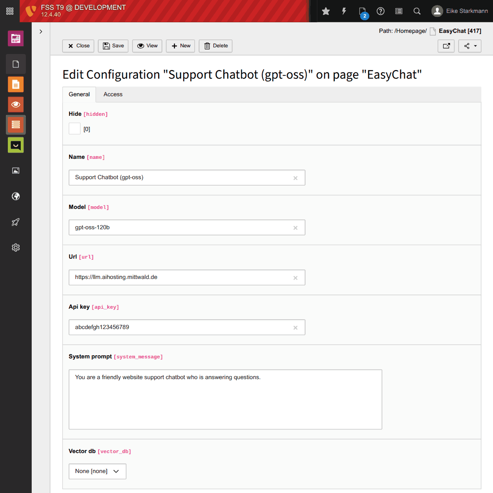
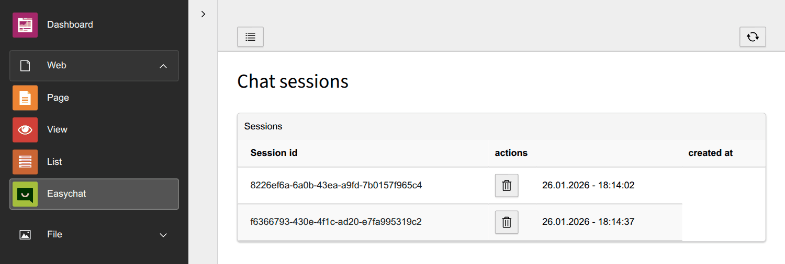
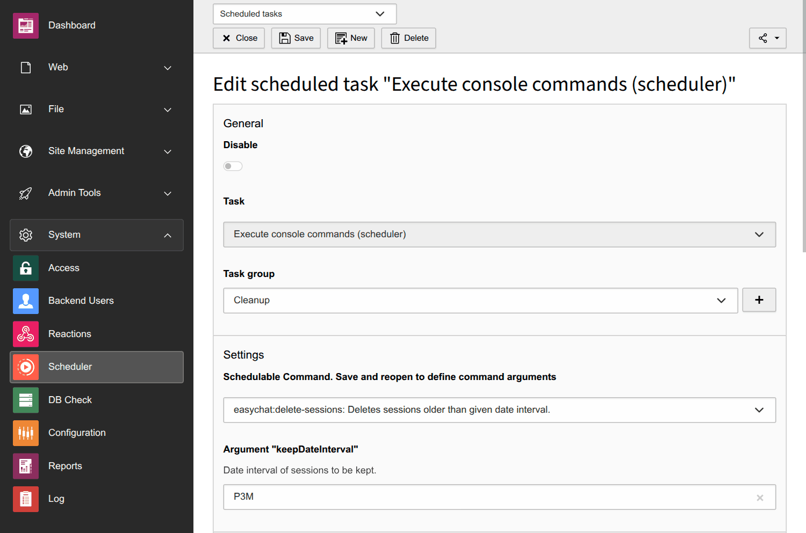

# TYPO3 Chatbot: EasyChat


<span style="float:left;margin-right: 1em"></span>
**EasyChat** is a lightweight open source chatbot für TYPO3 websites without third party chat tools.

EasyChat is focused on privacy and data protection, since all chat conversions are only stored in your TYPO3 database.
-icon

## Key Features

* 🗨 **Chatbot frontend**
  * based on the open source chat framework [Deep Chat](https://deepchat.dev) (Supports: Vanilla JS, Vue, React, Angular etc.)


* 🤖 **LLM Endpoints** for
  * (self hosted) open source LLM's (e.g. gpt‑oss) and
  * standard LLMs (ChatGPT, Cloude Opus, Mistral etc.)
  * Chat memory (Chatbot can remember old questions)


* 🔒 **Data protection**:
  * Chat session **data is saved only within TYPO3** (on your own server)
  * Optional **privacy consent** before the chat starts
  * Automated **cleaning of user data** (scheduler task)


* ⛁ **Knoledge base** connector (to vector database)


## How to setup EasyChat in 4 Steps

### Install the TYPO3 Extension (Step 1)

Install the *TYPO3 ChatBot Extension "EasyChat"* via [composer](https://getcomposer.org/doc/):

```console
composer require undkonsorten/easychat
```

After installation a database compare is necessary to create new tables.

### Configure the LLM provider (Step 2)

Now you need to connect TYPO3 to your LLM's provider via API. Create a new record "Configuration" in TYPO3.


<span style="width: 30%; margin-block-start: 1em; float: right; display: block">
_Screenshot: Configuration of LLM an vector database connections ([enlarge image](Documentation/Assets/LLM-Configuration.png))_
</span>

Fill out the fields of the *Configuration record*. Here Examples for:

* **mittwald** LLM Hosting
    * Name:  `Support Chatbot via Mittwald (gpt-oss)`
    * URL (of the API endpoint): `https://llm.aihosting.mittwald.de`
    * Model (of the LLM): `gpt-oss-120b`
    * API Key: `abc123xyz...`
    * System Message (Promt): `You are a support chatbot for the website www.example.com. Be friendly. Answer short.`
    * Vector database: `none` / `Redis`
    * Host (of vector database)
    * Port (of vector database)
    * Name (of vector dataase)


* **Gemini (Google) API**
    * Name:  `Gemini Support Chatbot`
    * URL (of the API endpoint): `https://generativelanguage.googleapis.com/v1beta/models/gemini-1.5-flash:generateContent?key=YOUR_API_KEY"`
    * Model (of the LLM): `gemini-1.5-flash`
    * Api key (of your LLM provider): [generate here](https://aistudio.google.com/api-keys)
    * System Promt: `You are a support chatbot for the website www.example.com`

Currently (Jan 2026) you can get a free plan API testing here:
* [Mistral](https://console.mistral.ai/)
* [Google AI Studio](https://aistudio.google.com/)
* [HugginFace]
* [Grog](https://console.groq.com/)
* Cohere

OpenAi (ChatGpt) and Antrophic (Claude) offen only payed plans.

There are also webhosting providers in Germany with AI API endpoints. We are testing [mittwald](https://www.mittwald.de/mstudio/ai-hosting) at the moment (Jan 2026).

### Setup the TYPO3 Reaction (Step 3)

A TYPO3 Reaction needs to be created as an endpoint for the chatbot frontend and TYPO3.

### Setup the Content Element (Step 4)

Create a new content element "Chatbot". Connect the content Element to the reaction.
Fill the fields.

----

## Backend module for chat session logs

With the **EasyChat backend module** you can watch, review and delete single chat session.


_Screenshot: Backend Module with Session overview_

## Automated cleaner task for deleting old chat session

For data protection we recommend to setup the *cleaner task* in order to delete old chat sessions.


_Screenshot: Scheduler Module - Sessions cleaner task_

Steps:
* Choose the task `Execute console commands (scheduler)`
* Schedulable Commend: `easychat:delete-sessions: Deletes sessions older than given date interval.`
* Set the scheduler interval
* Save !
* Then define the `keepDateInterval` in the [ISO 8601 durations format](https://en.wikipedia.org/wiki/ISO_8601#Durations).


| Duration             | ISO 8601 Format |
|:---------------------|:----------------|
| 1 Day                | P1D             |
| 2 Weeks              | P2W             |
| 3 Months             | P3M             |
| 1 Year               | P1Y             |
| 1 Year and 2 Months  | P1Y2M           |


---

## Known Problems

### TYPO3 12 Compatibility

If you went to install EasyChat with TYPO 12.4,
you need to remove the package `typo3/cms-install` due to composer conflicts.

## To Do

* Documentation
  * Theming DeepChat

### Planned Featues

* website scraping for the knowledge base
* connector to Vector database (Chroma) as a knowledge base for the chatbot
