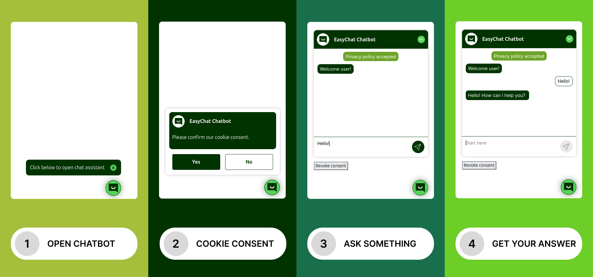

# EasyChat Chatbot (TYPO3 Extension)

----


----

**EasyChat** is a lightweight open source chatbot for [TYPO3](https://typo3.org) websites without third party chat tools.

All you need is TYPO3 and an LLM endpoint.

EasyChat is **focused on privacy** and data protection, since all chat conversations are only stored in your TYPO3 database.




## 🚀 Features

* 🗨 **Chatbot frontend**
  * based on the open source chat framework [Deep Chat](https://deepchat.dev) (Supports: Vanilla JS, Vue, React, Angular etc.)


* 🤖 **LLM Endpoints** for
  * (self-hosted) open source LLMs (e.g. gpt‑oss) and
  * standard LLMs (ChatGPT, Claude Opus, Mistral etc.)
  * Chat memory (Chatbot can remember old questions)


* 🔒 **Data protection**:
  * Chat session **data is saved only within TYPO3** (on your own server)
  * Optional **privacy consent** before the chat starts
  * Automated **cleaning of user data** (scheduler task)


* ⛁ **TYPO3 content as knowledge base (RAG, Vector Database)**
  * TYPO3 Content to RAG via [ext:index](https://extensions.typo3.org/extension/index)
  * Connector (to Qdrant vector database)

---

## 🛠️ Setup guide (4 Steps)

### 1. Install the TYPO3 Extension

Install the **TYPO3 ChatBot Extension _EasyChat_** via [composer](https://getcomposer.org/doc/):

```console
composer require undkonsorten/easychat
```

After installation a **database compare** is necessary (via [Install Tool](https://docs.typo3.org/m/typo3/reference-coreapi/main/en-us/ApiOverview/Database/DatabaseUpgrade/Index.html#database-upgrade) or [TYPO3 Console](https://docs.typo3.org/m/typo3/reference-coreapi/main/en-us/ApiOverview/CommandControllers/ListCommands.html#console-command-extension-setup)) to create new tables.

### 2. Configure the LLM provider

Now you need to connect TYPO3 to your LLM provider via API.
Create a new database record "Configuration" in TYPO3.


Then fill out the fields of the *Configuration record*.

[](Documentation/Assets/Configuration.png)

The *LLM Settings* (URL, API key, model, system prompt) are always required. The *Vector DB* settings
(shown here with Qdrant and EXT:index configurations) are only needed if the chatbot should answer from your own
content (RAG); leave *Vector db* on `None` otherwise. See
[How reactions, configurations and index configurations connect](#how-reactions-configurations-and-index-configurations-connect).

#### Sample configurations for your LLM

* **Mistral** (Free plan available | [How to get an API key?](Documentation/How-to-get-API-Keys.md))
    * Name:  `Mistral (mistral-tiny)`
    * Model (of the LLM): `mistral-tiny`
    * URL (of the API endpoint): `https://api.mistral.ai`
    * API Key: `your-api-key-abc123xyz-...`
    * System Message (Prompt): `You are a support chatbot ...`

More samples (OpenAI, mittwald, Groq, Ollama …) → [Sample configurations](Documentation/Sample-LLM-Configurations.md)

### 3. Setup the TYPO3 Reaction

A **TYPO3 Reaction** needs to be created.
The reaction serves as a connector (aka endpoint) between the chat frontend and TYPO3.

[](Documentation/Assets/Reaction.png)

* Create a new reaction with the *Reaction Type* `Reaction for easychat`.
* Be sure to *copy the generated secret* before saving
* Choose one of the previously created *EasyChat configuration records*
  * This choice decides **everything the chatbot uses**: the LLM, and — if the configuration has a vector
    database — which vector database/collection it searches and therefore which *Index configurations*
    (EXT:index) it knows about. See
    [How reactions, configurations and index configurations connect](#how-reactions-configurations-and-index-configurations-connect).

After successfully creating the reaction you will see the following interface.

[](Documentation/Assets/Reactions.png)

Now also *copy the reaction URL* (like `https://my-domain.com/typo3/reaction/afce5efb-861e-4e0e-8a8b-d159f194670d`).
You will need it in step 4.

### 4. Setup the Content Element

Last but not least you need to setup a *content element for the chatbot*.
* Be sure to have your *Reaction URL and secret* available.

* Open a TYPO3 page
* Add/create a new content element "Chatbot".
* Connect the content Element to the reaction.

> Hint: Use /typo3/reaction/XXXXXXXX-XXXXX instead of https://mydomain.dev/XXXXXXXX-XXXXX in order to be domain independent (on Local, Staging, Live)

[](Documentation/Assets/Content-Element.png)

### ✨ YOU ARE DONE!!! 👊 CONGRATULATIONS 🎉

----

## Session storage in TYPO3

### How are chat sessions stored?

Each browser session (the `easychat_session_id` cookie) maps to **exactly one row** in `tx_easychat_domain_model_session`. The whole conversation — the system prompt plus every
question and answer — is stored in that row.

[](Documentation/Assets/Backend-Module.png)

With the **EasyChat backend module** you can
* Watch, review, delete and export chat sessions
* Export as CSV: Click *Export as CSV* on the session list or *Export this session as CSV* on a single session's detail view


## Cleaner task: Delete old chat sessions

For data protection we recommend setting up the 🗑 *cleaner task* in order to delete old chat sessions.

[](Documentation/Assets/Scheduler-Task.png)

Steps:
* Choose the task `Execute console commands (scheduler)`
* Schedulable command: `easychat:delete-sessions: Deletes sessions older than given date interval.`
* Set the scheduler interval
* Save!
* Then define the `keepDateInterval` in the [ISO 8601 durations format](https://en.wikipedia.org/wiki/ISO_8601#Durations): 1 Day = `P1D`, 2 Weeks = `P2W`, 3 Months = `P3M`, 1 Year = `P1Y`, 1 Year and 2 Months = `P1Y2M`

----


## Extension Configuration

EasyChat has a small set of global options in the **Extension Configuration**
(*Admin Tools → Settings → Extension Configuration → `easychat`*, or in
`config/system/settings.php`):

| Key | Default | Meaning |
|:----|:--------|:--------|
| `storagePid` | `1` | Page/folder UID where chat sessions (`tx_easychat_domain_model_session`) are **stored and read**. This applies both to the chat endpoint that saves conversations and to the backend module that lists them — they always use the same value. |
| `itemsPerPage` | `50` | Number of sessions per page in the backend module list. |

```php
// config/system/settings.php
'EXTENSIONS' => [
    'easychat' => [
        'storagePid' => '1',
        'itemsPerPage' => '50',
    ],
],
```

We recommend pointing `storagePid` at a dedicated **SysFolder** rather than the root page.

----


## Knowledge base (RAG)

EasyChat can answer questions **using your own TYPO3 content and files as a knowledge base** instead of (or in addition to) the LLM's general knowledge, by embedding your pages/files into a **vector store** (like Qdrant).

The **knowledge indexing** itself is delegated to and configured via the [TYPO3 Extension _Index_](https://github.com/lochmueller/index), a generic
TYPO3 content-crawling framework. EasyChat listens to the indexer and pushes the crawled content into the vector store(s) of any matching *EasyChat Configuration* record.

_Index_ can be configured to read
* content elements,
* plugin content (e.g. FAQs, News) but also
* Files (manuals, documentation in PDF, XLS etc.)

### Quick setup

1. `composer require symfony/ai-qdrant-store`
2. Create an *EXT:index* configuration on your root page and the two scheduler tasks `index:queue` and `messenger:consume`.
3. On your *EasyChat configuration* set *Vector db* to `Qdrant`, fill in the connection fields and select the index configuration(s).
4. Make sure the *reaction* uses exactly this EasyChat configuration.

[More indexer setup hints here →](Documentation/Indexer.md)

### How reactions, configurations and index configurations connect

Everything hangs off the **EasyChat configuration** record that a reaction points to:

```
  Content element (chatbot / User)
  │
  ▼
  Reaction
  │
  ▼
  EasyChat configuration
  ├─ LLM (model, API url/key, system message)
  ├─ Vector DB (Qdrant host/port, collection, API key, embeddings model)
  └─ Index configurations (EXT:index)
     │
     ▼
     content written into that collection
```

* **At chat time** the reaction loads its EasyChat configuration, and the similarity search queries
  exactly the vector database/collection configured there.
* **At index time** EasyChat looks up, for every crawled page or file, all EasyChat configurations whose
  *Index configurations* field contains the index configuration that is running, and writes the content
  into each of their collections. Configurations with *Vector db* `none` are ignored.

So the *Index configurations* field on the EasyChat configuration is **the one place that decides what a
chatbot knows**, and the reaction decides **which** configuration (and thus which knowledge base) a
chatbot uses.

## Multiple Chatbots

You can run **multiple chatbots** with different system prompts, LLMs or knowledge bases simultaneously in one TYPO3 installation.

This is especially useful for testing.


----

## Theming & Templates

### Chat Frontend: Deep Chat

EasyChat comes along with *Deep Chat* - an **open source chat web component** in the frontend.

[](Documentation/Assets/DeepChat.png)

For simplicity we integrated *Deep Chat* as a plain **Vanilla JS** web component, but [it can be used with many other frameworks](https://deepchat.dev/examples/frameworks) (e.g. React, Vue, Svelte, Angular).
EasyChat is able to communicate with popular AI providers, but can also connect to your own servers - in our example with TYPO3.

DeepChat is an example implementation. Feel free to use another chatbot frontend.
The default dummy template is located at
* `/Resources/Private/Templates/ChatFrontend.html`.

### Styled version

If you want to use our *suggested default styles for ChatBot & Cookie Consent* you need to include the TypoScript templates in `/Configuration/Styling/`.

[](Documentation/Assets/Styling-TypoScript.png)

### How to add your own styles 💐

You can either overlay the default template or the styled template, by setting your own template paths.

```typoscript
# overlay the easychat styled version
plugin.tx_easychat.view {
    partialRootPaths.10 = EXT:my-sitepackage/Resources/Private/_Default/Easychat/Partials/
    templateRootPaths.10 = EXT:my-sitepackage/Resources/Private/_Default/Easychat/Templates/
}
```

Be aware,
* there are many ways to inject styles into a web component like `<deep-chat>`
* keep also in mind the styles for the chatbot trigger button and the consent module

### How to Change the texts

You can edit some of the content directly in the frontend.

You can override texts used in the template via locallang.xml or via TypoScript.

```typoscript
plugin.tx_easychat {
    _LOCAL_LANG {
        default.easychat_nagscreenMessage = Hast du Fragen zu unserem Angebot?
        default.easychat_dataProtectionConsentAcceptedMessage = Einwilligung erteilt
    }
}
```
---

## Development & testing

Tests and code checks run in containers via `Build/Scripts/runTests.sh` (docker or podman), no local PHP needed.

→ See [Documentation/Development-and-Testing.md](Documentation/Development-and-Testing.md) for all commands, Composer scripts and CI details.

----

## Credits

🙏 This TYPO3 Extension was built by the Berlin-based digital agency [undkonsorten](https://undkonsorten.com).
* Eike Starkmann (Product Owner & Inspirator, TYPO3 Development)
* Lars Hayer (Frontend, Theming)
* Thomas Alboth (Product Owner & Documentation)
* Jule Nott (UI Design)
* Felix Althaus & J. (Critical Thinking)

---

## License

[GNU General Public License, version 2](http://www.gnu.org/licenses/gpl-2.0.html)


----


## Upgrading

### From 0.1.x to 0.2.0

- **Database compare required**: new columns on `tx_easychat_configuration` and the new table `tx_easychat_index_point`.
- **Vector dimensions are configurable**: Qdrant collections used to be created with a hardcoded size of 4096. The new field *Embedding dimensions* (`vector_db_dimensions`) defaults to 1536. If you already use a vector store, set it to the size of your existing collection (4096 for collections created by 0.1.x), or drop the collection and re-index.
- **New dependency**: `typo3/cms-install` is now required.
- **API change**: `StoreFactory::create()` takes a new required `int $dimensions` argument and throws an exception for unsupported store types.
- **Sessions**: new sessions are stored on the configured storage PID. The session table is now visible in the list module, and its fields are read-only.

----

## Planned Features

### To Do

* Add Redis as a vector store
* Connect EasyChat configuration and reaction URL directly
* More LLM settings (like temperature)
* Voting for good/bad answers
* Pre suggested questions

### Implemented

* ✅ Version 0.2.0 ~~Website scraping/indexing via TYPO3 for the knowledge base (via vector database)~~ — done, see
  [Knowledge base (RAG)](#knowledge-base-rag)

----

## Contact

Any more ideas, questions, suggestions? Feel free to 📧 [contact us](https://undkonsorten.com/kontakt).

**Contact** us via [our website](https://www.undkonsorten.com/kontakt), [GitHub](https://github.com/undkonsorten/easychat) or [TYPO3 Slack](https://typo3.slack.com/archives/C0C3U5GABFZ).
